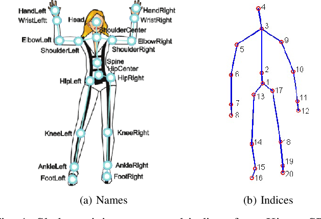

# Human-Activity-Recognition

This project classifies different human activities into their respective actions using the `LibSVM` library. The data is taken from microsoft kinect dataset which can also be downloaded from [here](http://pr.cs.cornell.edu/humanactivities/data.php). 




# Dependencies

* python 2.7
* Numpy
* CSV
* pandas
* Libsvm

# Run Instructions

```bash
git clone
jupyter notebook filename.py 

```

# Contents

* The train and test folders contain the training and testing data which can also be downloaded from [here](http://pr.cs.cornell.edu/humanactivities/data.php)

* The code to generate the Libsvm format training and testing data are `Rad.py` , `HJPD.py`, `HOD.py`
 
* The repository contains 3 folders rad , hjpd , hod. Each folder contains the representation files (eg: rad_d2, rad_d2.t, its grid search graphs files, and the prediction file eg: pr1 )


-RAD: 
prediction file-> pr1,pr2,pr3

-HJPD:
prediction file-> phj1 , phj2

-HOD:
prediction file-> ph1


# Results

* The best values for C and gama are:

-RAD: C = 2  gama= 0.125

-HJPD:  C = 2   gama= 0.00781

-HOD:   C = 128  gama = 0.00195


Accuracy for the different representations.

RAD = 54.16%

HJPD = 83.333%

HOD = 53.09%


